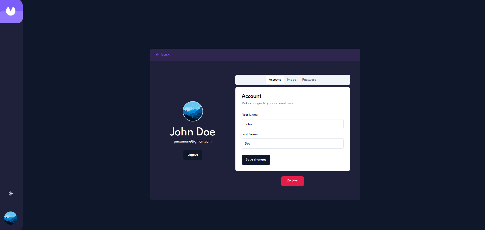

# Charge-Up / Invoice Application
Welcome to project Charge-Up! An invoice full-stack application that allows users to register/login, add invoices based on billing information, view and sort through invoices, and edit, delete, and mark invoices as paid or pending. The application contains light and dark mode options, a mobile first responsive design, and user account details that can be updated at any time.

## Getting Started

First, run the development server:

```bash
npm run dev
# or
yarn dev
# or
pnpm dev
# or
bun dev
```

Open [http://localhost:3000](http://localhost:3000) with your browser to see the result.

## Application Structure

<br>

The application consists of a frontend and backend, both of which are created through Next.js, meanwhile the database is created through using Postgres configured through Vercel. The application makes use of API routes to hit various data fetching endpoints to make CRUD operations to and from the frontend, backend, and database. 

The initial welcome, login, and register pages are viewable by logged out users, and not accessible by logged in users since they are already signed in. If they try to access these pages, they will be redirected back to the dashboard page. The dashboard, account, create invoice, specific invoice id pages, and all of the features and components associated with them are only viewable and accessible by logged in users.

## Previews

**Welcome Page:**<br><br>


**Dashboard Page / Dark Mode / View Invoices:**<br><br>


<br>**Dashboard Page / Light Mode / View Invoices:**<br><br>


<br>**Dashboard Page / Mobile Version**<br><br>


<br>**Dashboard Page / Select Invoice Type [All, Paid, or Pending]**<br><br>


<br>**Edit invoices:**<br><br>


<br>**Delete invoices:**<br><br>


<br>**Account Page:**<br><br>


## View Application

Link: [deepgit-charge-up.vercel.app ](https://deepgit-charge-up.vercel.app/)

## Technologies Utilized
- HTML
- Tailwind CSS
- Typescript
- Next.js
- Vercel / PostgreSQL
- shadcn-UI [UI components]
- React Icons

## Learn More

To learn more about Next.js, take a look at the following resources:

- [Next.js Documentation](https://nextjs.org/docs) - learn about Next.js features and API.
- [Learn Next.js](https://nextjs.org/learn) - an interactive Next.js tutorial.

You can check out [the Next.js GitHub repository](https://github.com/vercel/next.js/) - your feedback and contributions are welcome!
